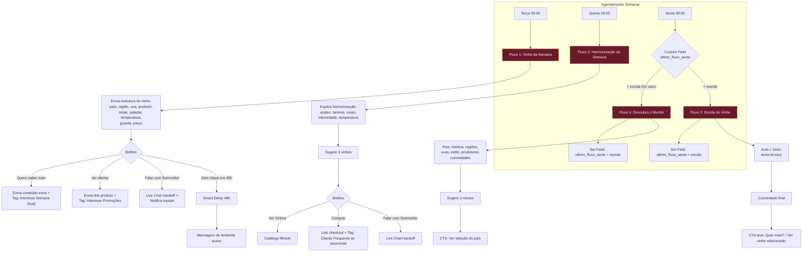
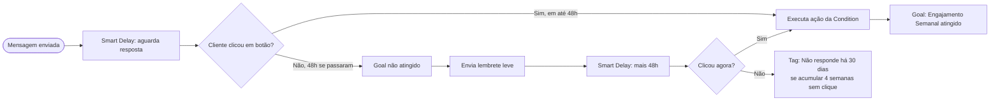

# Arquitetura Geral — Sistema de Relacionamento WhatsApp (Vino Bianco Store)
## Sommelier Particular via ManyChat + WhatsApp Business API

---

## VISÃO GERAL

Este sistema substitui comunicação de "robô de vendas" por um relacionamento contínuo de **sommelier particular**: a marca aparece semanalmente na vida do cliente com curadoria, ensino e cultura do vinho — não com oferta. A venda é consequência da autoridade e da confiança construídas semana a semana.

### Os 4 Fluxos

| Fluxo | Nome no ManyChat | Disparo | Objetivo |
|---|---|---|---|
| 1 | `FLUXO_VINHO_DA_SEMANA` | Toda terça, 09:00 | Autoridade + descoberta de produto |
| 2 | `FLUXO_HARMONIZACAO_DA_SEMANA` | Toda quinta, 09:00 | Educação aplicada + intenção de compra |
| 3 | `FLUXO_ESCOLA_DO_VINHO` | Sexta (alternado), 09:00 | Autoridade técnica, sem venda direta |
| 4 | `FLUXO_DESCUBRA_MUNDO_VINHO` | Sexta (alternado), 09:00 | Cultura, storytelling de origem |

**Regra de alternância de sexta:** Fluxo 3 e Fluxo 4 nunca disparam na mesma semana. Um controla o outro via **Custom Field** `ultimo_fluxo_sexta` (valores: `escola` | `mundo`). O gatilho de sexta sempre checa esse campo antes de decidir qual dos dois enviar, e atualiza o valor ao final.

---

## FLUXOGRAMA GERAL (Mermaid)



### Fluxograma de decisão por clique (detalhe do Fluxo 1, replicável nos demais)



---

## ESTRUTURA DE PASTAS DO PROJETO

```
07-relacionamento-whatsapp-manychat/
├── 00-arquitetura-geral.md          ← este arquivo (visão geral, mermaid, tags, campos, ações)
├── 01-fluxo1-vinho-da-semana.md     ← flow completo + exemplos de mensagem prontos
├── 02-fluxo2-harmonizacao-semana.md ← flow completo + exemplos de mensagem prontos
├── 03-fluxo3-escola-do-vinho.md     ← flow completo + exemplos de mensagem prontos
├── 04-fluxo4-descubra-mundo-vinho.md← flow completo + exemplos de mensagem prontos
├── 05-calendario-anual.md           ← 156 tópicos únicos, semana a semana, sem repetição
├── 06-integracao-json-api.md        ← JSON de referência para Shopify/RD Station
├── manychat_setup.py                ← script para criar Tags e Custom Fields via API
├── 07-checklist-implementacao.md    ← checklist final, do zero ao ar
└── 08-manual-operacional-iniciante.md ← passo a passo visual para montar tudo sem saber programar
```

---

## TAGS (ManyChat → Settings → Tags, ou via script `manychat_setup.py`)

| Tag | Quando é aplicada |
|---|---|
| `Cliente Novo` | Primeira interação no WhatsApp |
| `Cliente VIP` | Ticket médio acima do definido pela loja OU marcado manualmente |
| `Comprou Espumante` | Após compra confirmada dessa categoria (via webhook loja → ManyChat) |
| `Comprou Branco` | Idem, categoria branco |
| `Comprou Rosé` | Idem, categoria rosé |
| `Comprou Tinto` | Idem, categoria tinto |
| `Cliente Frequente` | 2+ compras em 90 dias |
| `Interesse Bordeaux` | Clicou em conteúdo relacionado à França/Bordeaux |
| `Interesse Itália` | Clicou em conteúdo relacionado à Itália |
| `Interesse Portugal` | Clicou em conteúdo relacionado a Portugal |
| `Interesse Espumantes` | Clicou em conteúdo/oferta de espumantes |
| `Interesse Promoções` | Clicou em "Ver ofertas" em qualquer fluxo |
| `Não responde há 30 dias` | 4 semanas seguidas sem clique em nenhum CTA |
| `Reengajado` | Voltou a clicar após ter a tag anterior |

---

## CAMPOS PERSONALIZADOS (Custom Fields)

| Campo | Tipo | Uso |
|---|---|---|
| `nome` | Texto | Personalização de mensagem |
| `ultimo_vinho_comprado` | Texto | Recomendação futura / recompra |
| `data_ultima_compra` | Data | Cálculo de recência (RFM) |
| `cidade` | Texto | Segmentação regional / frete |
| `estado` | Texto | Segmentação regional |
| `tipo_favorito` | Texto | Tinto / Branco / Rosé / Espumante |
| `faixa_de_preco` | Texto | Segmentação de oferta |
| `data_aniversario` | Data | Gatilho de campanha especial (fora do escopo dos 4 fluxos, mas já preparado) |
| `sommelier_responsavel` | Texto | Nome do atendente humano no handoff |
| `ticket_medio` | Número | Segmentação VIP |
| `ultimo_fluxo_sexta` | Texto | Controle de alternância Fluxo 3 / Fluxo 4 |
| `contador_semanas_sem_clique` | Número | Controle da tag "Não responde há 30 dias" |

---

## LÓGICA MANYCHAT — COMPONENTES USADOS

- **Smart Delays:** usados entre o envio da mensagem principal e o lembrete de reforço (48h), e entre cada bloco de conteúdo dentro de uma mesma mensagem longa (evita bloco único gigante, que é ignorado no WhatsApp)
- **Conditions:** decidem qual bloco de conteúdo/CTA seguir com base em tags e custom fields (ex: `ultimo_fluxo_sexta`, `tipo_favorito`)
- **Tags:** guardam interesse e histórico comportamental (ver tabela acima)
- **Custom Fields / User Fields:** guardam dados estruturados do cliente (ver tabela acima)
- **Randomizer:** usado nos CTAs finais de Fluxo 3 e 4 para testar 2 variações de copy (A/B leve) sem duplicar o conteúdo educativo em si
- **Goals:** `Engajamento Semanal` (clicou em algum CTA da semana), `Conversão Harmonização` (clicou em "Comprar" no Fluxo 2), `Reengajamento` (voltou a clicar após tag de inatividade)
- **Actions:** Add Tag / Remove Tag / Set Custom Field / Send Flow / Live Chat Handoff / External Request
- **Flows:** um Flow por fluxo (4 principais) + Flows auxiliares reutilizáveis: `AUX_ENVIAR_CATALOGO`, `AUX_HANDOFF_SOMMELIER`, `AUX_LEMBRETE_48H`
- **External Request:** bloco preparado (não ativo ainda) em cada flow, apontando para endpoint futuro de Shopify (consulta de estoque/preço em tempo real) e RD Station (sincronização de lead/CRM) — ver `06-integracao-json-api.md`

---

## PRÓXIMOS ARQUIVOS

Continue para `01-fluxo1-vinho-da-semana.md` para o detalhamento completo do primeiro fluxo, com mensagens prontas para colar.
